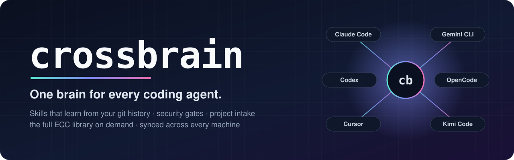
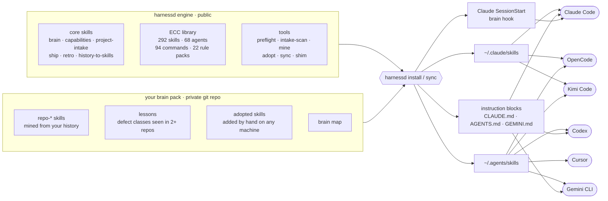
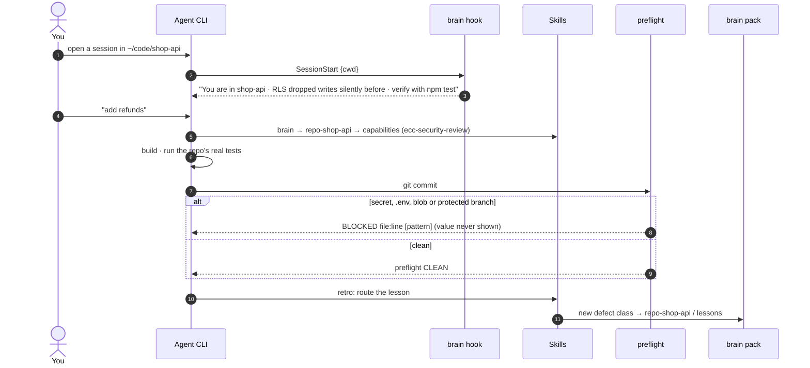
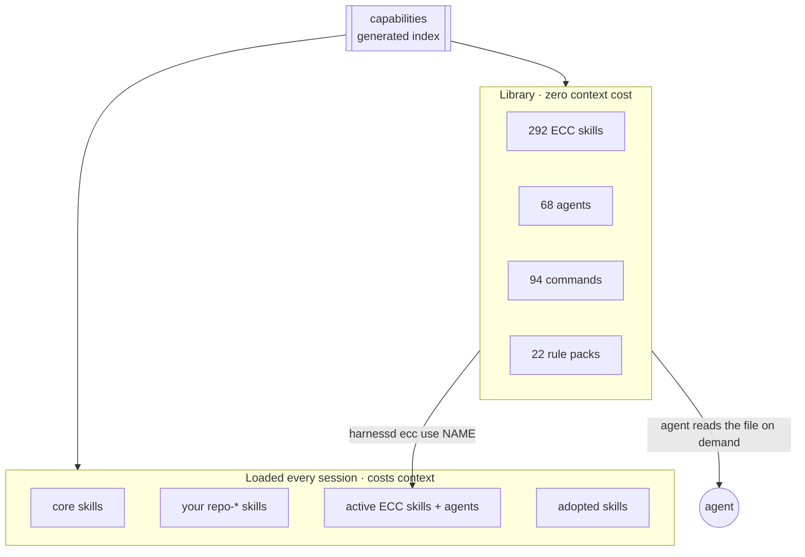
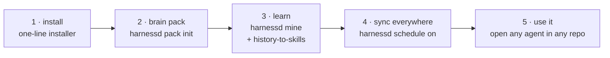
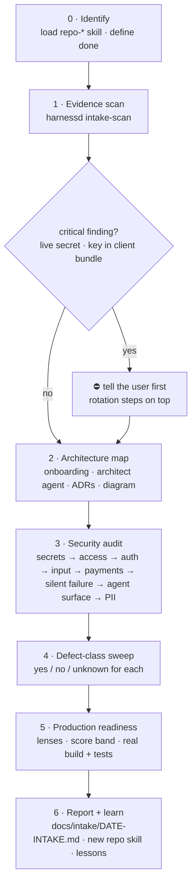
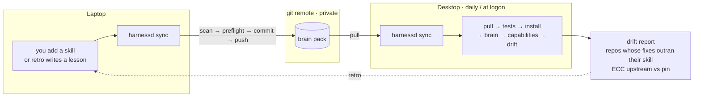
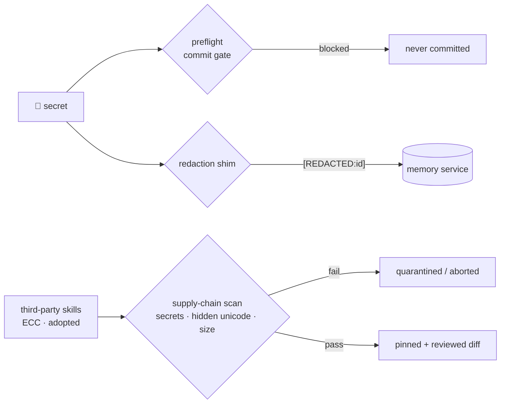

<p align="center">
  
</p>

<p align="center">
  <a href="https://github.com/imodoiepale/harnessd/actions/workflows/ci.yml"></a>
  <a href="LICENSE"></a>
  
  
  
  
</p>

<p align="center">
  
  
  
  
  
  
</p>

<p align="center">
  
  
</p>

<p align="center">
  <b>Your coding agents forget everything between sessions. harnessd gives them one shared, growing brain</b><br>
  skills learned from your own git history · security gates at the end of the pipeline · a fixed procedure for any project ·<br>
  the entire <a href="https://github.com/affaan-m/ecc">ECC</a> library on demand · identical on every machine, in every agent CLI.
</p>

---

## ⚡ One-line install

**macOS · Linux · WSL**

```bash
curl -fsSL https://raw.githubusercontent.com/imodoiepale/harnessd/main/install.sh | bash
```

**Windows (PowerShell)**

```powershell
irm https://raw.githubusercontent.com/imodoiepale/harnessd/main/install.ps1 | iex
```

It clones the engine to `~/.harnessd/engine`, adds a `harnessd` command, installs skills into every agent CLI it finds, and runs
`harnessd doctor`. Re-run it to update. It needs `git` and Python 3.9+, and it never asks for or stores a credential.
[Read install.sh](install.sh) before piping it to a shell, since it's short.

---

## Table of contents

- [Why](#-why)
- [What you get](#-what-you-get)
- [How it works](#-how-it-works)
- [Works with every agent CLI](#-works-with-every-agent-cli)
- [Quick start](#-quick-start)
- [The skills](#-the-skills)
- [Project intake](#-project-intake-any-project-same-procedure)
- [Knowledge that grows across machines](#-knowledge-that-grows-across-machines)
- [Security model](#-security-model)
- [CLI reference](#-cli-reference)
- [FAQ](#-faq)
- [Contributing](#-contributing) · [License](#-license)

---

## 🧭 Why

Throughput is rarely the problem with AI coding agents. **Memory and the end of the pipeline are.**

- **Corrections repeat.** A preference restated in five repos over two weeks was never written anywhere the next session reads.
- **Bugs repeat.** Your history already records every defect class you shipped, but no agent ever reads it.
- **Leaks happen late.** Secrets get committed "for a minute", blobs bloat history, and changes skip review, all at commit time.
- **Every tool has its own silo.** Claude Code, Codex, Cursor, Gemini CLI, OpenCode and Kimi Code each keep separate rules and skills.
- **Every machine drifts.** Your laptop's agent knows things your desktop's doesn't.

harnessd fixes this with plain files and git. There's no server, database, or cloud account, and nothing captures your transcripts.

---

## ✨ What you get

| | Capability | What it means for you |
|---|---|---|
| 🧠 | **Brain** | Opening an agent in a repo automatically surfaces that repo's stack, verify commands, and *the bugs it already shipped*. |
| 📚 | **History → skills** | `harnessd mine` turns every repo's git history into redacted digests, and `history-to-skills` distils one skill per repo with commit-cited defect classes. |
| 🗂️ | **Capabilities** | One generated, self-updating index of *everything* an agent can use: your skills, plugin skills, and the full ECC library. |
| 🛡️ | **Preflight gate** | Blocks secrets, `.env` files, blobs over 5 MB, and protected-branch commits. It runs as a pre-commit hook in every repo, and it's regression-tested against real leaks *and* real false positives. |
| 🔍 | **Project intake** | A fixed sequence for any unfamiliar project: evidence scan, architecture map, security audit, defect-class sweep, production readiness, and a report. |
| 📦 | **Full ECC library** | 292 skills, 68 agents, 94 commands, and 22 language rule packs, vendored, pinned, and scanned. Any of it can be read on demand or promoted to always-loaded. |
| 🔄 | **Sync & adoption** | Drop a skill into `~/.claude/skills` on any machine, and the next sync scans it, commits it to your private brain pack, and installs it on every other machine. |
| 🧩 | **Every agent CLI** | One install feeds Claude Code, Codex, Cursor, Gemini CLI, OpenCode and Kimi Code. |
| 🔒 | **Memory redaction shim** | A localhost proxy that strips secrets from requests before a memory service stores them. |

---

## 🏗️ How it works



**Engine vs pack.** The engine is generic and public. Your knowledge (skills distilled from *your* repos, your lessons, the skills
you adopt) lives in a separate **brain pack**, which is usually a private git repo. Updating the engine never conflicts with your
knowledge, and nothing personal can end up in the public repo.

### A session, start to finish



### Capabilities: have everything, load only what you need



Every installed skill's description is loaded at the start of **every** session. Loading all of ECC would add 15–20k tokens
before you type anything, and some of its skills claim universal triggers. So all of it is *available* through the `capabilities` index,
and only a curated set is *loaded*.

---

## 🧩 Works with every agent CLI

| Agent CLI | Skills | Instructions | Session brain card |
|---|:---:|:---:|:---:|
| **Claude Code** | ✅ `~/.claude/skills` | ✅ `CLAUDE.md` | ✅ |
| **Codex** | ✅ `~/.agents/skills` | ✅ `~/.codex/AGENTS.md` | via `brain` skill |
| **Cursor** | ✅ `~/.agents/skills` | Settings → Rules | via `brain` skill |
| **Gemini CLI** | ✅ `~/.agents/skills` | ✅ `~/.gemini/GEMINI.md` | via `brain` skill |
| **OpenCode** | ✅ `~/.claude/skills` + `~/.agents/skills` | opt-in `AGENTS.md` | via `brain` skill |
| **Kimi Code** | ✅ `~/.claude/skills` + `~/.agents/skills` | — | via `brain` skill |
| **Anything that reads Agent Skills** | ✅ add a target | — | — |

The paths, sources and caveats are in **[docs/HARNESSES.md](docs/HARNESSES.md)**. For example, OpenCode's instruction file is opt-in, because creating
it would hide your `CLAUDE.md` from OpenCode.

---

## 🚀 Quick start



```bash
# 1. install (see above), then check what was detected
harnessd doctor

# 2. create your private brain pack and push it to a PRIVATE remote
harnessd pack init ~/my-brain
cd ~/my-brain && git remote add origin git@github.com:you/my-brain.git

# 3. teach it your history (point projects_root at the folder holding your repos)
harnessd config projects_root ~/code
harnessd mine --out ~/harnessd-digests
#    then in your agent: "use the history-to-skills skill on ~/harnessd-digests"
harnessd brain

# 4. install everywhere, now and every day
harnessd sync
harnessd schedule on

# 5. gate every repo
harnessd hooks install --all
```

On a second machine, install harnessd, then run `harnessd pack add ~/my-brain` after cloning your pack, and `harnessd sync`. That's it.

---

## 🧠 The skills

| Skill | Use it when |
|---|---|
| **`brain`** | Starting any task. It routes to the repo skill, capabilities, intake, ship and retro. |
| **`capabilities`** | "Is there a skill for X?" It covers everything available, including the full ECC library. It's generated and never hand-edited. |
| **`project-intake`** | Taking on any unfamiliar, inherited or client project, or "is this safe / what's the architecture". |
| **`history-to-skills`** | Setting up, adding a repo, or when `harnessd drift` shows fixes newer than a skill. |
| **`ship`** | Committing, pushing, PRs, releases. It covers branch lanes, preflight, why-not-what commits and honest PRs. |
| **`retro`** | Ending a task. It routes the lesson to the one place the next session will read. |
| **`ecc-*`** (active set) | Security review, production audit, codebase onboarding, ADRs, migrations, Postgres, deployment, verification, Next.js, hexagonal architecture. |

Five ECC reviewer agents install as Claude Code subagents: `ecc-security-reviewer`, `ecc-silent-failure-hunter`,
`ecc-architect`, `ecc-database-reviewer` and `ecc-code-reviewer`.

```bash
harnessd ecc search stripe webhook     # find anything in the library
harnessd ecc show tdd-workflow         # read it
harnessd ecc use tdd-workflow          # make it always-loaded (on every machine after sync)
harnessd ecc drop nextjs-turbopack
```

---

## 🔍 Project intake: any project, same procedure



The scanner is deterministic and read-only, and it never prints a secret value:

| Area | Checks |
|---|---|
| **Architecture** | stack, layout, API routes, migrations, edge functions, workers, tests, CI, agent docs, code graph |
| **Secrets** | tracked secret files · secret patterns at HEAD **and in git history** · secret-named `NEXT_PUBLIC_`/`VITE_` vars · hardcoded env fallbacks · `.env` not ignored |
| **Access** | tables vs `ENABLE ROW LEVEL SECURITY` · `SECURITY DEFINER` without `REVOKE` · views without `security_invoker` · JWT decoded but not verified |
| **Supply chain** | hidden or bidi Unicode in `CLAUDE.md`, `AGENTS.md`, `.mcp.json`, `.claude/`, `.cursor/rules/` |
| **Hygiene** | personal-data files · files over 5 MB · tracked `node_modules` · copy files · multiple lockfiles · no tests / CI / pre-commit gate |

```bash
harnessd intake-scan ~/code/shop-api          # one repo → markdown
harnessd intake-scan --all --summary          # every repo: scores and counts only
```

---

## 🔄 Knowledge that grows across machines



- **Adoption:** a skill dropped into `~/.claude/skills` or `~/.agents/skills` is scanned for secrets, hidden Unicode and files over 5 MB,
  then copied **without** `node_modules`, committed and pushed. A skill that fails the scan is quarantined: it stays local and is reported.
- **Drift:** each sync lists repos with fix commits newer than their skill, so lessons don't go stale.
- **Safety:** sync refuses to install from a checkout whose tests fail. Nothing is synced from transcripts.

---

## 🛡️ Security model



- **One pattern set** (`scripts/secret-patterns.txt`) is shared by the gate, the redactor, the scanner and the supply-chain scans.
- **Third-party content is pinned.** Upstream moves are *reported*, never auto-applied.
- **Deliberately not included:** transcript capture, ECC's hook runtime and installer, and its prompt-capturing observer.
- **Honest limits:** a secret that matches no pattern still gets through, and the SQL checks are leads, not a live schema read.

Full threat model: **[docs/SECURITY.md](docs/SECURITY.md)**.

---

## 📟 CLI reference

| Command | Does |
|---|---|
| `harnessd install [--targets claude,agents] [--dry-run]` | Install skills, agents, instruction blocks and the Claude hook |
| `harnessd sync [--no-push] [--quiet]` | Pull → tests → adopt → install → brain → capabilities → drift |
| `harnessd schedule on\|off` | Daily and at-logon sync (Task Scheduler / cron) |
| `harnessd doctor` | Detected agent CLIs, targets, packs and hook status |
| `harnessd pack init\|add <dir>` | Create or attach a brain pack |
| `harnessd config [key [value]]` | Read or change `~/.harnessd/config.json` |
| `harnessd mine [--out DIR]` | Git history → redacted per-repo digests |
| `harnessd brain` | Rebuild the brain map from `repo-*` skills |
| `harnessd capabilities [--check\|--local]` | Rebuild the capabilities index |
| `harnessd adopt [--dry-run]` | Adopt hand-added skills into your pack |
| `harnessd ecc search\|show\|use\|drop\|list` | Work with the ECC library |
| `harnessd intake-scan <repo> \| --all [--summary]` | The deterministic project audit |
| `harnessd preflight [--staged] [path]` | The commit gate |
| `harnessd hooks install\|uninstall [path\|--all]` | The gate as a git pre-commit hook |
| `harnessd drift` | Repos whose fixes outran their skill, plus ECC upstream status |
| `harnessd shim [--port N]` | Localhost secret-redacting proxy for memory services |

<details>
<summary><b>Configuration</b>: <code>~/.harnessd/config.json</code></summary>

```json
{
  "projects_root": "~/code",
  "packs": ["~/my-brain"],
  "skill_targets": ["claude", "agents"],
  "instruction_targets": ["claude", "codex", "gemini"]
}
```

Available skill targets are `claude`, `agents`, `codex`, `cursor`, `gemini`, `opencode` and `kimi`. Instruction targets are `claude`,
`codex`, `gemini` and `opencode`. Set `HARNESSD_HOME` to move the config and state directory.
</details>

<details>
<summary><b>Repository layout</b></summary>

```
harnessd/
├── harnessd.py              CLI
├── install.sh / install.ps1 one-line installers
├── skills/                  core skills + active ECC skills + generated capabilities
├── agents/                  active ECC subagents
├── vendor/ecc/              the full ECC library (pinned, scanned)
├── scripts/                 preflight · project_audit · mine · adopt · sync · install · shim · tests
└── docs/                    HARNESSES.md · SECURITY.md
```
</details>

---

## ❓ FAQ

<details>
<summary><b>Does it send my code or prompts anywhere?</b></summary>

No. harnessd is local files plus git. It has no telemetry and no server. The only network calls are `git` operations on remotes you
configure, and an optional `git ls-remote` to check whether ECC has moved upstream.
</details>

<details>
<summary><b>Do I need a brain pack?</b></summary>

No. Install alone gives every agent the core skills, the capabilities index, the ECC library and the preflight gate. A pack is what
lets your *own* lessons and hand-added skills follow you across machines.
</details>

<details>
<summary><b>Why not install all 292 ECC skills?</b></summary>

Every installed skill's description loads into every session. All of ECC costs roughly 15–20k tokens before you type, and several
skills claim universal triggers that collide with each other. The library tier keeps all of it one file-read away.
`harnessd ecc use <name>` loads anything you use often.
</details>

<details>
<summary><b>Will it overwrite my existing CLAUDE.md / AGENTS.md?</b></summary>

No. It writes a single block between `<!-- harnessd:begin -->` and `<!-- harnessd:end -->`, and it only touches tools whose config folder
already exists. Skills and agents that harnessd did not install are never replaced or removed.
</details>

<details>
<summary><b>How do I uninstall?</b></summary>

```bash
harnessd schedule off
harnessd hooks uninstall --all
python ~/.harnessd/engine/scripts/install_brain_hook.py --uninstall
```

Then delete the skill folders listed in `~/.claude/skills/.harnessd-manifest.json` and `~/.agents/skills/.harnessd-manifest.json`, the
harnessd blocks in your instruction files, and `~/.harnessd`.
</details>

---

## 🤝 Contributing

Issues and PRs are welcome. Read **[CONTRIBUTING.md](CONTRIBUTING.md)**. The short version: run the tests, ship fixtures for any new check
(a catch *and* a real-world string that must stay quiet), keep everything generic, and cite docs for any harness path.

## 🙏 Credits

- **[ECC](https://github.com/affaan-m/ecc)** by Affaan Mustafa (MIT): the skills, agents, commands and rule packs in `vendor/ecc/`.
- The [Agent Skills](https://agentskills.io) format, which lets one skill folder work across agent CLIs.

## 📄 License

[MIT](LICENSE). Vendored ECC content remains under its own MIT license ([vendor/ecc/LICENSE](vendor/ecc/LICENSE)).
